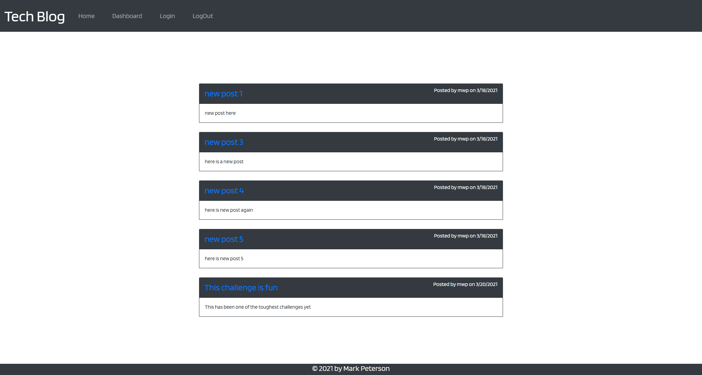

# **Tech-Blog-1**   
## **In this weekly challenge, we were tasked with building a full stack tech blog application.  This project utilizes HTML, CSS, Javascript, Node.js, Express.js, Express Handlebars and Bcrypt.**

## **Table of Contents**

* [Deployed Application](#deployed-application)

* [Screenshot](#screenshot)

* [Features](#features)

* [Usage](#usage)

* [License](#license)

* [Badges](#badges)

* [Technology](#technology)

* [Contact](#contact-information)

## **Deployed Application**
Heroku
https://tech-blog-mwp.herokuapp.com/

GitHub
https://mwpx777.github.io/Tech-Blog-1/

## **Screenshot**

## **Features**
This project features HTML, CSS, Javascript, Node.js, Express.js, Express Handlebars and Bcrypt.

## **Usage**
This application can be utilized for creating and commenting on tech blog posts.

## **License**
(https://opensource.org/licenses/ISC)

## **Badges**

## **Technology**
HTML,CSS,Javascript,jQuery,Bootstrap,Node.js

## **Contact Information**
##### For questions or comments, please contact

* Github: (https://github.com/mwpx777)

* LinkedIn: (https://www.linkedin.com/in/mwpdesigns/)

* Email: (mwpx777@gmail.com)

